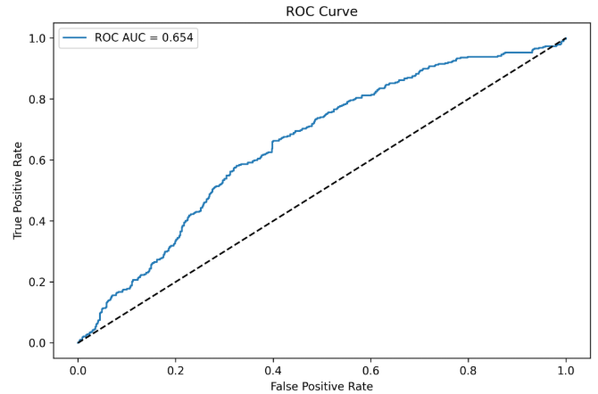
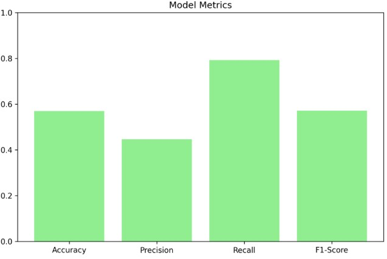
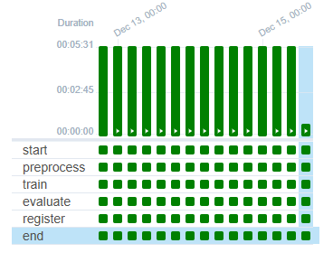
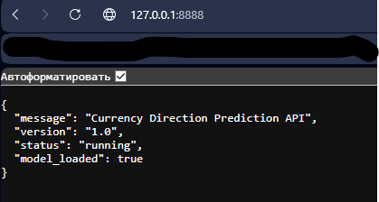
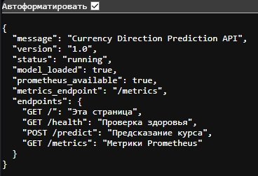

Описание  
Проект по предсказанию курса валют  


### Клонирование и настройка
```bash
git clone https://github.com/ваш-репозиторий/T25--4m_MLOps.git

cd T25--4m_MLOps
```


# Создание виртуального окружения
```bash
conda create -n tt25 python=3.10 -y

conda activate tt25

pip install -r requirements.txt
```


### Запуск проекта
```bash
# Загружаем данные и артефакты
dvc pull

# Запускаем полный pipeline
dvc repro
```


Данные:  
В датасете присутствуют:  
EUR_RUB - курс евро относительно рубля  
USD_RUB - курс доллара относительно рубля  
GBP_RUB - курс фунта стерлингов относительно рубля  
Начало датасета идет с начала 2015 года  

Графики из MLflow UI:  

  

  


Графики из Airflow:

  


Развернутый сервер модели:

  
 
 Работа с Prometheus:

   


Добавлена функция использования модели через Docker и FastAPI
